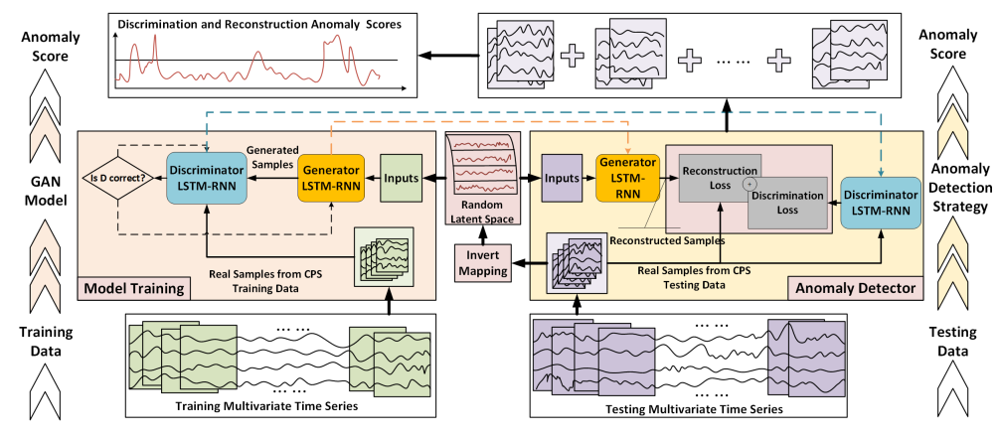

# MAD-GAN PyTorch 🧠🎨

Multivariate Anomaly Detection with GAN (MAD-GAN) PyTorch modern implementation.

This implementation is based on the model described in the MAD-GAN paper (https://arxiv.org/pdf/1901.04997.pdf).

## Model picture 🖼



## Train the MAD-GAN ⛹️‍♀️

To train the MAD-GAN neural network you need a preprocessed dataset in CSV format
(more formats will come soon).

The CSV should look like this:

```
feature1,feature2,feature3,featureN
0.1,-0.2,-0.7,0.8
0.1,-0.2,-0.7,0.8
0.1,-0.2,-0.7,0.8
...
```

> Note that for now time based windows are not supported (support will drop soon)

Then to train the model you just run the following CLI command.

```
$ python -m madgan train \
  data/dataset.csv
  --batch-size 32 \
  --epochs 8 \
  --model-dir models/madgan # Training checkpoints will be stored here
```

## Use a trained model

TBD

## References 📖

[1] [MAD-GAN: Multivariate Anomaly Detection for Time Series Data with Generative Adversarial Networks](https://arxiv.org/pdf/1901.04997.pdf)
